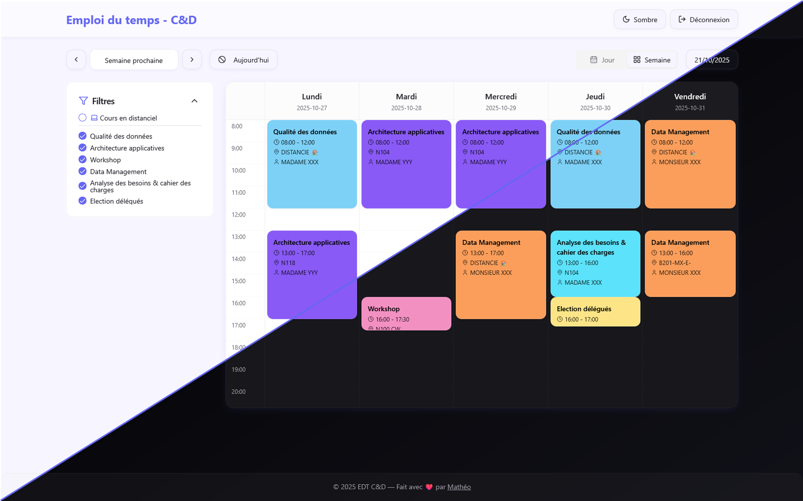

# 📅 EDT Manager

**EDT Manager** est une application web responsive permettant de visualiser un emploi du temps étudiant de manière claire et interactive. Elle récupère les données depuis le site EDT officiel, les parse et les affiche sous forme de **grille pour desktop** ou **liste pour mobile**, avec gestion des couleurs par matière et détails enrichis.

   
---


## 🛠️ Tech Stack

* **Frontend** : React + TypeScript + Vite
* **Styles** : Tailwind CSS
* **Icons** : lucide-react
* **HTTP Requests** : Axios
* **Parsing HTML** : DOMParser (pour transformer le HTML EDT en objets Course)
* **Gestion des couleurs** : Map dynamique par matière
* **Responsive** : Grid pour desktop, liste pour mobile

---

## ⚙️ Installation

1. **Cloner le projet :**

```bash
git clone https://github.com/D-Seonay/edt-hep.git
cd edt-hep
```

2. **Installer les dépendances :**

```bash
npm install
```

3. **Lancer le projet :**

```bash
npm run dev
```

4. **Accéder à l’application :**
   Ouvre [http://localhost:8080](http://localhost:8080) dans ton navigateur.

---

## 📁 Structure du projet

```
src/
 ├─ components/
 │   ├─ TimeGrid.tsx          # Grille / liste responsive
 │   ├─ CourseBlock.tsx       # Bloc de cours avec modale
 ├─ services/
 │   └─ scheduleService.ts    # Parsing HTML, fetch EDT, gestion couleurs, semaines
 ├─ lib/
 │   └─ utils.ts              # Fonctions utilitaires
 ├─ App.tsx
 └─ main.tsx
```

---


## ❤️ Contribuer

Si tu souhaites contribuer :

1. Fork le projet
2. Crée une branche feature : `git checkout -b feature/nom-fonctionnalité`
3. Commit tes modifications : `git commit -m "Ajout : nouvelle fonctionnalité"`
4. Push : `git push origin feature/nom-fonctionnalité`
5. Ouvre un Pull Request
